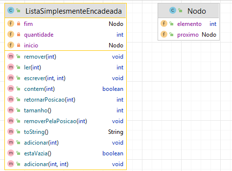

### Lista Simplesmente Encadeada

Encadeamento simples.

####Classe Nodo 
Cada objeto que fará parte da lista

####Classe ListaEncadeadaSimples

Atributo para o inicio e para o fim. Atributo com a quantidade de elementos.

