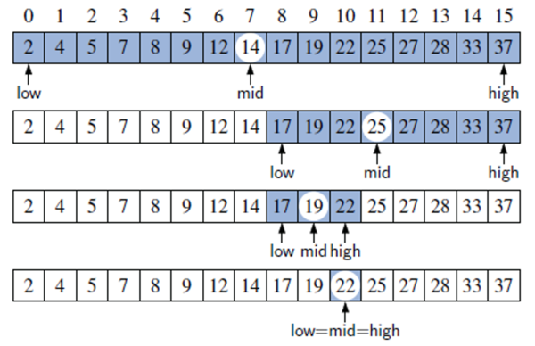

# Pesquisa em Coleções

Dois tipos de problemas muito comuns em computação:

### Pesquisa
* Como encontrar um elemento em uma coleção de dados?

### Ordenação 
* Garantir a ordem (númerica, alfabética, etc) em uma coleção de dados.

Para fins de simplificação vamos utilizar como coleção exemplos de arrays de inteiro. Entretanto as abordagens podem ser adaptadas para qualquer coleção.

## Algortimos de Pesquisa
* Visam encontrar um elemento em uma coleção, preferencialmente de forma **eficiente**.
* Dois casos:
  * Coleção desordenada
  * Coleção ordenada

### Pesquisa em coleções NÃO ORDENADAS (arrays desordenados)
O algoritmo recebe uma chave de pesquisa (um valor) e deve percorrer o array, elemento por elemento, até encontrar em elemento que tenha o valor igual ao valor passado (chave de pesquisa).
Nesse algortimo podemos ter o melhor caso quando o primeiro elemento do array já é o elemento procurado. Mas também podemos ter o pior caso, onde o valor procurado está na última posilção ou mesmo não existe no array.
Para chaves não existentes (elemento não existe no array) o algoritmo terá percorrido todo o array para descobrir que o mesmo não está lá.

Exemplo:

Encontrar o valor 5 na coleção [8,2,1,5,2,6]
O array não está ordenada, logo deve se comparar o 5 com 8, depois com 2, ...até chegar no elemento 5 e retornar que achou.
Condição de parada: valor encontrado. Encontrou, para.
Pior caso: pesquisar o elemento 7. Somente após percorrer o array inteiro o algoritmo vai retornar que o elemento não está ali.

Implementação de pesquisa:

    public static boolean pesquisar(int valor, int[] colecao)
    {
        //Pior caso: elemento não existe ou está no final.
        for(int i=0; i<colecao.length; i++)
        {
            if(colecao[i]==valor) {
                System.out.println("Achou na tentativa " + (i+1));
                return true;
            }
            System.out.println("Tentativa " + (i+1) + " nao achou.");
        }
        return false;
    }

### Pesquisa em coleções ORDENADAS 
Algoritmo recebe uma chave de pesquisa e inicia a procura pelo primeiro inicial. 

Se encontrar o valor então retorna. 

Se encontrar um valor maior que o elemento procurado então retorna que não encontrou. Como o array está ordenado, caso o valor no array seja maior que o valor pesquisado é sinal que o valor procurado não está no array e a busca pode ser interrompida. 

Caso percorra todo o array e mesmo assim não ache o elemento então retorna que não achou. Isso pode ocorrer quando o valor procurado é menor que todos os valores do array (terá que comparar com todos) ou quando algum valor maior está só no final do array.

Condição de parada: encontrar o valor exato ou encontrar um valor maior.

Pior caso geralmente não exige percorer tudo. Mas conforme mencionado acima isso não é regra.

Exemplo:

Encontrar o valor 5 na coleção [1,2,3,5,8,10].
Como a coleção está ordenada o algoritmo compara o 5 com 1, depois com 2, com 3, até chegar no 5, então retorna.

Encontrar o valor 6 na coleção [1,2,3,5,8,10].
O algortimo vai comparar apenas até o 8, uma vez que o 8 é maior que o 6 e após o 8 só temos elementos maiores ou iguais ao 8 o algoritmo já pode retornar que o elemento não existe no array.
Mais rápido que pesquisar em um desordenado nesse caso.
Caso ruim é quando pesquisar o 11, nesse caso tem que varrer o array inteiro.

Implementação:

    public static boolean pesquisarColecaoOrdenada(int valor, int[] colecao)
    {
        //Igual a colecao Desordenada
        for(int i=0; i<colecao.length; i++)
        {
            if(colecao[i]==valor) {
                System.out.println("Achou na tentativa " + (i+1));
                return true;
            }
            if(colecao[i]>valor){
                System.out.println("Valor nao esta na lista, pois ja achei um maior que ele. Nao preciso mais procurar.");
                return false;
            }
            System.out.println("Tentativa " + (i+1) + " nao achou.");
        }
        return false;
    }

### Pesquisa BINÁRIA

A pesquisa binária funciona **apenas** com coleções ordenadas. 

Reduz drasticamente o tempo de busca.

Como funciona?

Como o array está ordenado a comparação pode começar a ser feita com o elemento do meio do array. Se a chave procurada for maior que o elemento do meio então faz o mesmo para a metade direita (maiores) do array, senão faz o mesmo para a metade esquerda (menores do array) e assim por diante até encontrar o elemento.

O algoritmo mantém dois valores: low e high. Esses definem o intervalo atual da pesquisa.
Inicialmente low e high serão 0 e tamanho da coleção-1. Nesse exemplo low = 0 e high = 15.

_Pesquisar o valor 22:_

Comparação é feita com o elemento no meio do intervalo.

- mid = (low+high) / 2 (arredondar para baixo)
- mid = (0 + 15) /2, então mid = 7
- Elemento array[7] = 14.

Repetir o processo:

- mid = (8 + 15) / 2 = 11
- array[11] = 25 --> nao achou. 22 é menor que 25, então high = mid-1

Repetir o processo:
- mid = (8 + 11) / 2 = 9
- array[9] = 19 --> nao achou. 22 é maior que 19, então high=mid+1 

Repetir o processo:
- mid = (9 + 11) / 2 = 10 
- array[10] = 22 --> ACHOU!!!
 

Implementação:

Links adicionais:

